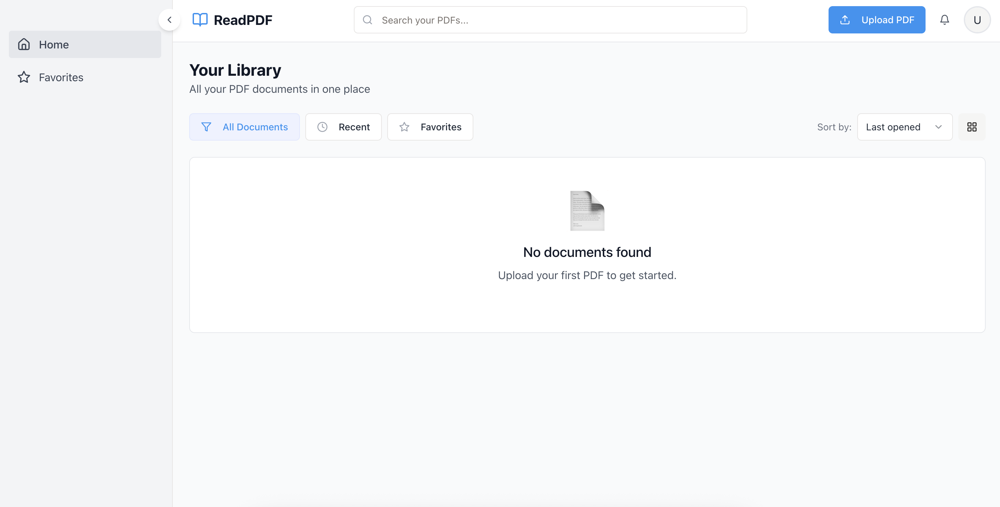

# PDF Reader Application

A modern PDF viewer with persistent storage capabilities and responsive controls.



## Features
- PDF viewing with zoom controls (50-200%)
- Fullscreen mode
- Print and download functionality
- Persistent URL storage across sessions
- Loading state indication
- Responsive design

## Technologies
- React + TypeScript
- Lucide React Icons
- File system persistence

## Installation

1. Clone the repository:
```bash
git clone https://github.com/imkrunalkanojiya/PDFReader.git